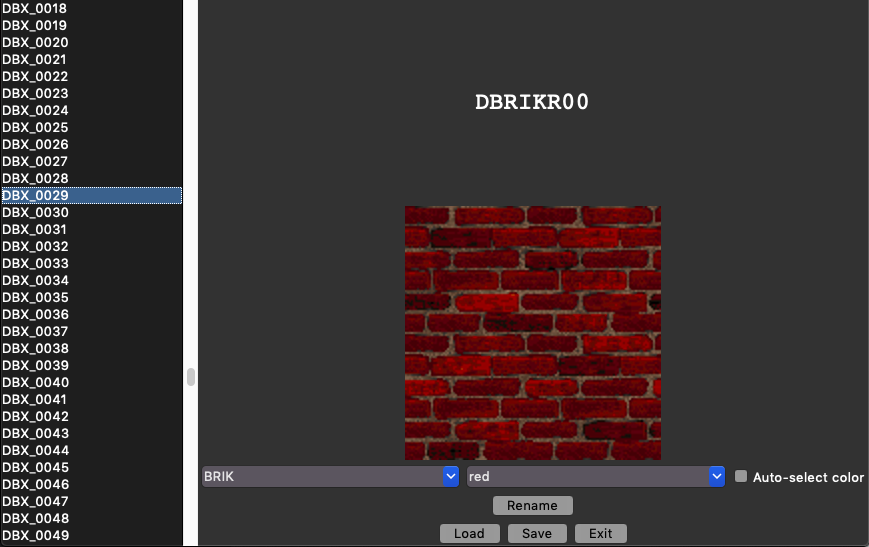

# texSorter

Doom TEXTURE Lump Sorting Tool

Requires: pillow, tkinter, omgifol, webcolors

1. Click "Load" and open your WAD. Textures will be listed on the left.
2. Select a texture from the listbox.
3. Select a category.
4. Select a color (or use the auto-chosen one)
5. Click "Rename" to rename the texture according to the naming scheme.
    - The label at the top is a preview of the name that will be used.

Edit `tsorter.json` to add/modify the categories and colors.

The tool will auto-match dominant colors against the colors in the `AutoColors` table of `tsorter.json`.

# remapper.py

Tool to remap textures. Useful if you already made a map with the old texture names and want to convert it as-is to the new texture names.

# TODO/Stuff that doesn't work

- Multi-patch textures
- Overwriting already-sorted textures
- Textures &gt;99 in a single category (need to proceed 99, A0, A1, .., B0, ..., AA, AB, .., ZZ, or something like that)

